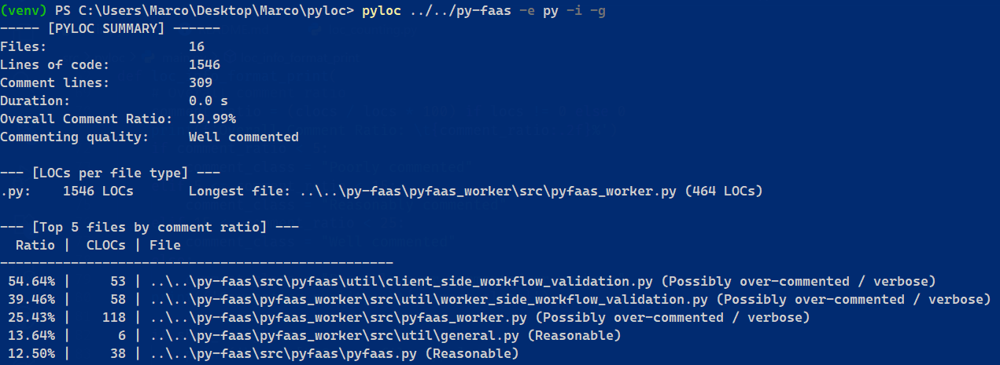

# PyLoC: LoC Counter
This is a very lighweight tool developed for personal usage to keep track of how much a project is growing overtime in terms of <strong>LoCs (Lines of Code)</strong> and <strong>CLoCs (Comment Lines of Code)</strong>.

## Installation (system-wide)
Via `pip install`:
```bash
git clone https://github.com/marcoimbee/pyloc.git
cd pyloc
pip install .
```
Note that at least `Python v3.9` is required for running this tool.

## Usage
```bash
pyloc <path> [-e EXT1 EXT2 ...] [-g] [-i]
```
- `<path>`: required path to target directory
- `-e, --extensions EXT1 EXT2 ...`: space-separated list of file extensions to include (e.g., `py .java. cpp`). If omitted, all supported extensions are scanned
- `-g, --use_gitignore`: exclude files and directories included in the local `.gitignore` file
- `-i, --insights`: additionally show stats about the execution (number of LOCs divided by file type, longest file for each file type, ordered by LOC count in descending order)
<!-- - `-et, --emable_threading`: enables multi-threaded LOC counting (which is disabled by default) -->

### Example
```bash
pyloc my_project -e .py .java -g -i
```
Counts all Python and Java lines of code in the directory `my_project`, skipping files included in `my_project/.gitignore`. Will also show the total number of LOCs for `.py` files and for `.java` files separately, along with the longest file for each extension. 
Data about how well-commented the project (in terms of considered files) is will be shown as well.
<!-- Moreover, threading is enabled: if `my_project` is a very large repository, the execution will be shorter. -->

An output can be the following:
